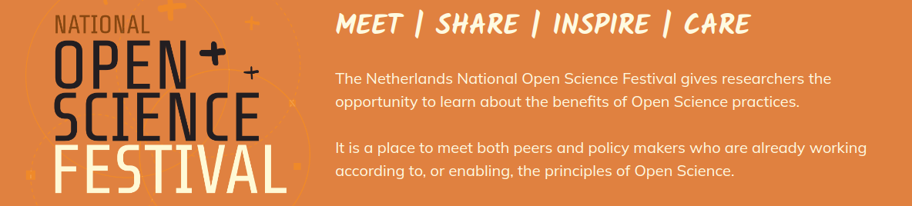

Open Science Festival
======================

This page contains information relevant to the **workshop part of the Open Science Festival 2023, Rotterdam.**

.. important::
   **If you have received an invitation to join our Virtual Lab.** Follow the steps below to configure access to a remote desktop where you can run *Fairly* and its JupyterLab extension during the workshop. This is a convenient way to follow the workshop without installing the toolset on your computer.

   Alternatively, you can install the toolset on your computer. See the instructions in :ref:`installation`.

You will receive two emails when you have been added to the Azure Virtual Lab. The first email will contain an invitation to get access to an account in our organisation and a *username*; the second email will contain a *password*. Follow the steps below to configure access to our organisation and the Virtual Lab.

.. warning:: 
    The invitations will expire after a few days. You will need to contact us to get a new invitation.
    Please notice that the use of Virtual Labs is still in an **experimental phase** in our organisation, and the invitations will be rolled out gradually up until the date of the workshop. If you have questions or encounter any problems, please contact us via `this email <mailto:m.g.garciaalvarez@tudelft.nl>`_.

1. Activate Organization Account
--------------------------------

1. Accept the invitation by clicking the link in the email. You will be redirected to a Microsoft log-in page where you can activate your account
2.  Using the *username* and *pasword* you have received by email activate you account. You must change your password and complete the two-factor authentication using the Microsoft Authenticator app on your phone. **Please make sure to write down your new password**. You will need it to access the Virtual Lab.
3. Once you complete the account activation, log in to the Virtual Lab website https://labs.azure.com/ using your new account.

    .. note::

        If you use other Microsoft accounts, you may need to log out first and then log in again using your new account. Ensure you are logged in to the correct account by checking the account name in the top right corner of the Azure Lab Portal. The account name you will receive from us contains the word **tudefltcloud4researchacc**.

4. You should see the **OpenScience Festival** virtual machine. **Showing the virtual machine in your account may take some time**. Please check after a while if you do not see it immediately.

    .. image:: img/labs-home.png
       :alt: Azure Portal

2. Access Remote Desktop
-------------------------

On the day of the workshop, you can access the virtual machine using a remote desktop. Follow the steps below to access the remote desktop.

1. Start the virtual machine by switching the toggle button to the left **(1)**. The button will turn blue when the virtual machine is running.

    .. image:: img/labs-start.png
       :alt: Azure Port

2. Click on the **Connect** button **(2)**. A file with the extension **OpenScienceFestival.rdp** will be downloaded to your computer.

3. On your computer, double-click on the downloaded file. You will be asked to connect to your virtual machine using a username and password. **The username and password for this step will be provided also by email.**
 
