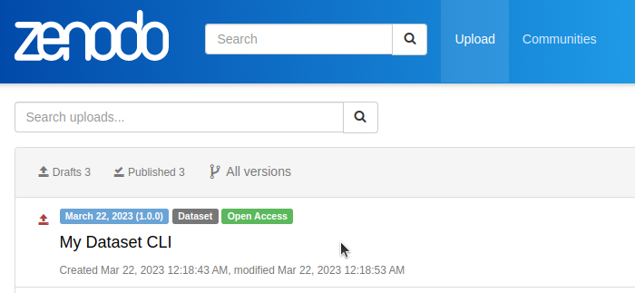

Using the CLI
=====================

This tutorial shows how to use the *fairly* Command Line Interface (CLI) to clone, and create datasets, and to edit their metadata.

.. important::
   **Windows Users.** For the following to work, you need Pyton in the PATH environment variable on Windows. If your not sure that is the case. Open the Shell, and type :code:`python --version`. You should see the version of Python on the screen. If you see otherwise, follow these steps to `add Python to the PATH on Windows <https://realpython.com/add-python-to-path/#how-to-add-python-to-path-on-windows>`_

1. Open a *Terminal* or *Shell*

2. Test the *fairly* CLI is accessible in your terminal, by calling the help command:

.. code:: shell
   
   fairly --help

You should see the following:

   .. code:: shell

      Usage: fairly [OPTIONS] COMMAND [ARGS]...                                                                                        
                                                                                                                                      
      ╭─ Options ──────────────────────────────────────────────────────────────────────────────────────────────────────────────────────╮
      │ --install-completion        [bash|zsh|fish|powershell|pwsh]  Install completion for the specified shell. [default: None]       │
      │ --show-completion           [bash|zsh|fish|powershell|pwsh]  Show completion for the specified shell, to copy it or customize  │
      │                                                              the installation.                                                 │
      │                                                              [default: None]                                                   │
      │ --help                                                       Show this message and exit.                                       │
      ╰────────────────────────────────────────────────────────────────────────────────────────────────────────────────────────────────╯
      ╭─ Commands ─────────────────────────────────────────────────────────────────────────────────────────────────────────────────────╮
      │ config                                                                                                                         │
      │ dataset                                                                                                                        │
      │ list-repos               List all repositories supported by fairly                                                             │
      │ list-user-datasets       List all datasets in the specified repository by doi, title, and publication_date                     │
      ╰────────────────────────────────────────────────────────────────────────────────────────────────────────────────────────────────╯   

Cloning a Dataset
--------------------

1. Create a new directory and subdirectory :code:`workshop/clone` 

   .. code:: shell

      # On Windows
      mkdir workshop
      mkdir workshop\clone

      # On Linux/MacOS
      mkdir -p  workshop/clone

2. Go to the :code:`clone` directory

   .. code:: shell

      # On Windows
      cd workshop\clone

      # On Linux/MacOS
      cd  workshop/clone

3. Clone this `Zenodo dataset <https://zenodo.org/records/7748718#.ZBozNdLMJhE>`_, using its URL:

   .. code:: shell

      fairly dataset clone --url https://zenodo.org/records/7748718#.ZBo1SNLMJhF

4. Explore the content of the dataset, notice that file(s)  of the dataset have been downloaded and its metadata is in the :code:`manifest.yaml` file.

   .. code:: shell

      manifest.yaml  Trixi.jl-v0.5.14.zip

Creating a Local fairly Dataset
--------------------------------------

We can use the CLI to initialize a new dataset.

   1. Create a new directory called :code:`mydataset-cli` inside the *workshop* directory. Then move to into the directory

   .. code:: shell

      # On Windows/Linux/McOS
      mkdir mydataset-cli
      cd mydataset-cli

   2. Create a local dataset using the Zenodo metadata template, as follows

   .. code:: shell

      fairly dataset create zenodo

Include Files in your Dataset
''''''''''''''''''''''''''''''''

Add some folders and files the :code:`mydataset-cli` directory.  You can do this using the file explorer/browser. You can add files of your own, but be careful not to include anything that you want to keep confidential. Also consider the total size of the files you will add, the larger the size the longer the upload will take. Also remember that for the current Zenodo API each file should be :code:`100MB` or smaller; this will change in the future.

If you do not want to use files from your own, you can download and use the `dummy-data <https://drive.google.com/drive/folders/160N6MCmiKV3g-74idCgyyul9UdoPRO8T?usp=share_link>`_ 

Editing the Manifest
''''''''''''''''''''''

The :code:`manifest.yaml` file contains several sections to describe the medatadata of a dataset. Some of the sections and fields are compulsory (they are required by the data repository), others are optional. In this example, you started a *fairly* dataset using the template for the Zenodo repository, but you could also do so for 4TU.ResearchData. 

However, if you are not sure which repository you will use to publish a dataset, use the :guilabel:`default` option. This template contains the most common sections and fields for the repositories supported by *fairly*

.. tip::
   Independently of which template you use to start a dataset, the :code:`manifest.yaml` file is interoperable between data repositories, with very few exceptions. This means that you can use the same manifest file for various data repositories. Different templates are provided only as a guide to indicate what metadata is more relevant for each data repository. 

1. Open the :code:`manifest.yaml` using a text editor. On Linux/MacOS you can use **nano** or **vim**. On Windows use the **notepad**

2. Substitute the content of the :code:`manifest.yaml` with the text below.  *Here, we use only a small set of fields that are possible for Zenodo.*
   
.. code-block:: yaml

   metadata:
     type: dataset
     publication_date: '2023-03-22'
     title: My Title CLI
     authors:
     - fullname: Surname, FirstName
       affiliation: Your institution
     description: A dataset from the Fairly Toolset workshop
     access_type: open
     license: CC0-1.0
     doi: ''
     prereserve_doi:
     keywords:
     - workshop
     - dummy data
     notes: ''
     related_identifiers: []
     communities: []
     grants: []
     subjects: []
     version: 1.0.0
     language: eng
   template: zenodo
   files:
     includes:
     - ARP1_.info
     - ARP1_d01.zip
     - my_code.py
     - Survey_AI.csv
     - wind-mill.jpg
     excludes: []

3. Edit the dataset metadata by typing the information you want to add. For example, you can change the title, authors, description, etc. Save the file when you are done.

.. important:: 
   * The :code:`includes`  field must list the files  and directories (folders) you want to include as part of the dataset. *Included files and directories will be uploaded to the the data repository* 
   * The :code:`excludes` field can be used for explicitly indicating what files or directories you **don't want to be part  of the dataset**, for example, files that contain sensitive information. Excluded files and directories will never be uploaded to the data repository. 
   * Files and directories that are not listed in either :code:`includes` or :code:`excludes` will be ignored by *fairly*.

Upload Dataset to Data Repository
-----------------------------------

Here, we explain how to upload a dataset to an existing account in Zenodo. If you do not have an account yet, you can `sign up in this webpage. <https://zenodo.org/signup/>`_

For this, you first need to :ref:`create-token` and register it manually or :ref:`via JupyterLab <configuring-fairly>`.

Upload Dataset
''''''''''''''''

1. On the terminal or command prompt, type:

   .. code:: shell

      fairly dataset upload zenodo

2. Go to your Zenodo and click on :guilabel:`Upload`. The `My dataset CLI` dataset should be there. 

Explore the dataset and notice that all the files and metadata you added in JupyterLab has been automatically added to the new dataset. You should also notice that the dataset is not **published**, this is on purpose. This gives you the oportunity to review the dataset before deciding to publish if, and if necessary to make changes. In this way we also prevent users to publish dataset by mistake.

.. note:: 
   If you try to upload the dataset again, you will get an error message. This is because the dataset already exists in Zenodo. You can see this reflected in the :code:`manifest.yaml` file;  the section :code:`remotes:` is added to the file after succesfully uploading a dataset. It lists the names and ids of the repositories where the dataset has been uploaded.
   In the future, we will add a feature to allow users to update and sync datasets between repositories.
