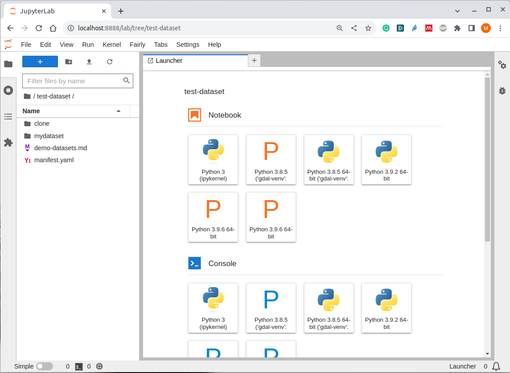

Using the JupyterLab Extension
==============================

This tutorial shows how to use the JupyterLab extension to clone and create research datasets using the graphical inteface of JupyterLab, and how to upload dataset  to popular research data repositories.

If you haven not done so, `install the full toolset. <https://fairly.readthedocs.io/en/latest/installation.html>`_

Start JupyterLab
------------------

Star JupyterLab with the **fairly** extension. This will start JupterLab in your browser.

Windows
''''''''

You will us the Shell Terminal to start JupyterLab.

.. important::
   For the following to work, you need Pyton in the PATH environment variable on Windows. If your not sure that is the case. Open the Shell, and type :code:`python --version`. You should see the version of Python on the screen. If you see otherwise, follow these steps to `add Python to the PATH on Windows <https://realpython.com/add-python-to-path/#how-to-add-python-to-path-on-windows>`_

On the shell type the following and press `Enter`:

.. code-block:: shell
   
   jupyter lab

Linux / MacOS
''''''''''''''''

From the terminal, run: 

.. code-block:: shell

   jupyter lab

JupyterLab should automatically start on you browser.

Part 1: Cloning Dastasets
----------------------------

Public research datasets can be cloned (copy and downloaded) directly to an empty directory, using the dataset **URL** or **DOI**. We will use `this datset <https://data.4tu.nl/articles/dataset/Earthquake_Precursors_detected_by_convolutional_neural_network/21588096>`_ from 4TU.ResearchData an example.

Using the JupyterLab inteface create a new directory called :code:`workshop`. Notice that the contents of your main directory would be different.

.. image:: ../img/create-directory.png

1. Inside the workshop directory, create a new directory called :code:`clone`
2. Right click on the left panel to open the context menu
3. Click on :guilabel:`Clone Dataset`
4. Copy and paste the URL for the example dataset on the dialog window
5. Click :guilabel:`Clone`

.. image:: ../img/clone2.png

After a few seconds, you should see a list of files on JupyterLab. All the files, except for :code:`manifest.yaml` are files that belong to the dataset in the research repository. The file :code:`manifest.yaml` is automatically created by the Fairly Toolset, and it contains metadata from the research data repository, such as:

- Authors 
- Keywords
- License
- DOI
- Files in the dataset
- etc.

Part 2: Create a Fairly Dataset
---------------------------------------------

Now, we will show you how can you create and prepare your own dataset using the JupyterLab extension of *fairly*.

   1. Create a new directory called :code:`mydataset` inside the *workshop directory*.
   2. Inside :code:`workshop/mydataset/`. Open the context menu and click on :guilabel:`Create Fairly Dataset`
   3. Select :guilabel:`Zenodo` as template from the drop-down list.
   4. Click :guilabel:`Create`. A :code:`manifest.yaml` file will add to the *mydataset* directory

.. image:: ../img/create-dataset1.png
.. image:: ../img/create-dataset2.png

Include Files in your Dataset
''''''''''''''''''''''''''''''''

Add some files to the :code:`mydataset` directory. You can add files of your own, but be careful not to include anything that you want to keep confidential. Also consider the total size of the files you will add, the larger the size the longer the upload will take. Also remember that for the current Zenodo API each file should be :code:`100MB` or smaller; this will change in the future.

If you do not want to use files from your own, you can download and use the `dummy-data <https://drive.google.com/drive/folders/160N6MCmiKV3g-74idCgyyul9UdoPRO8T?usp=share_link>`_ 

After you have added some file and/or folders to :code:`mydataset`, JupyterLab should look something like this:

Editing the Manifest
''''''''''''''''''''''

The :code:`manifest.yaml` file contains several sections to describe the medatadata of a dataset. Some of the sections and fiels are compulsory (they are required by the researh data repository), others are optional. In this example you started a *fairly* dataset using the template for the Zenodo repository, but you could also do so 4TU.ResearchData. 

However, if you are not sure which repository you will use to publish a dataset, use the :guilabel:`Default` template. This template contains the most common sections and fields for the repositories supported by the Fairly Toolset.

.. note::
   Independently of which template you use to start a dataset, the :code:`manifest.yaml` file is interoperable between data repositories, with very few exceptions. This means that you can use the same manifest file for various data repositories. Different templates are provided only as a guide to indicate what metadata is possible to provide in each data repository. 

1. Open the :code:`manifest.yaml` file using the context menu, or by doble-clicking on the file

.. image:: ../img/open-metadata.png

2. Edit the dataset metadata by typing in :code:`manifest.yaml` file, as follows. Here, we use only a small set of fields that are possible for Zenodo.

.. code-block:: yaml

   metadata:
   type: dataset
   publication_date: "2023-03-22"
   title: "My Dataset"
   authors: 
       - fullname: Your-Surname, Your-Name
         affilication: Your institution
   description: A dataset from the Fairly Toolset workshop
   access_type: open
   license: CC0-1.0
   doi: ""
   prereserve_doi:
   keywords:
      - workshop
      - dummy data
   notes: ""
   related_identifiers: []
   communities: []
   grants: []
   subjects: []
   version: 1.0.0
   language: eng
   template: zenodo
   files:
     includes:
     - ARP1_.info
     - ARP1_d01.zip
     - my_code.py
     - Survey_AI.csv
     - wind-mill.jpg
     - wind-mill.jpg
   excludes: []
   

.. note:: 
   The :code:`includes`  field must list the files you want to include as part of the dataset. They will be uploaded to the research data repository. The :code:`excludes` field can be use when you want to explicitly indicate what files you don't want to include as part of the datasets, for example, files that contain sensitive information.

Part 3: Upload Dataset to Zenodo
---------------------------------

In the last part of this tutorial, we explain how to upload a dataset to an existing account in Zenodo. If you do not have an account yet, you can `sign up in this webpage. <https://zenodo.org/signup/>`_

.. _create-token:
Create Personal Token
''''''''''''''''''''''

A personal token is a way in which data repositories identify a user. We need to set a token for creating datasets in the repository and uploading files to an specific account.

1. Sign in to Zenodo. 
2. On the top-right corner click on drop-down arrow, then :guilabel:`Applicaitons`.
3. On the section :guilabel:`Personal access tokens`, click the :guilabel:`New token` button.
4. Enter a name for your token, for example: :code:`workshop`
5. For scopes, check all three boxes, and click :guilabel:`Create`
6. Copy the token (list of characters in red) to somewhere secure. You will only see the token once.
7. Under :guilabel:`Scopes`, check all three boxes once more. Then click :guilabel:`Save`

.. _configuring-fairly:
Configure Fairly for Uploads
''''''''''''''''''''''''''''''''

Now, you will configure *fairly* to use your token.

Windows
""""""""""""

1. Using the Windows File Explorer, go to :code:`C:\Users\<You-user-name>\`
2. Create a directory called :code:`.fairly`
3. Inside :code:`~/.fairly`, create a file file called :code:`config.json`. You may need to change the explorer settings to show the file extension or *fairly* will not be able to read the token.
4. Copy the following test into this file, and add your token under **zenodo**

.. code-block:: json

   {
    "fairly": {
            "orcid_client_id":"APP-IELS3LR4OCLHLELC",
            "orcid_clien_secret": "",
            "orcid_token": ""
    },
    "4tu": {
    "token": "<your-token>"
    },
    "zenodo": {
    "token":"<your-token>"
    }
   }
   
5. Save the changes to the file

Linux/MacOS
""""""""""""""""

1. In your user home directory :code:`~/`, create hidden directory called :code:`.fairly`
2. Inside :code:`~/.fairly`, create a file file called :code:`config.json`
3. Copy the following test into this file, and add your token under **zenodo**

.. code-block:: json

   {
    "fairly": {
            "orcid_client_id":"APP-IELS3LR4OCLHLELC",
            "orcid_clien_secret": "",
            "orcid_token": ""
    },
    "4tu": {
    "token": "<your-token>"
    },
    "zenodo": {
    "token":"<your-token>"
    }
   }

4. Save the changes to the file

Upload Dataset
''''''''''''''''

Go back to JupyterLab and navigate to the  :code:`mydataset` directory. 

1. On the left panel, do right-click, and then click :guilabel:`Upload Dataset`
2. Select Zenodo from the dowp-down list, and click :guilabel:`Continue`
3. Confirm that you want to upload the dataset to Zenodo by ticking the checkbox.
4. Click :guilabel:`OK`. The download will take a moment to complete.
5. Go to your Zenodo and click on :guilabel:`Upload`. The `my dataset` dataset should be there. 

Explore the dataset and notice that all the files and metadata you added in JupyterLab has been automatically added to the new dataset. You should also notice that the dataset is not **published**, this is on purpose. This gives you the oportunity to review the dataset before deciding to publish. In this way we also prevent a user to publish dataset by mistake.

.. note:: 
   Notice that in the current version of the JupyterLab extension, repeating the steps to upload a dataset will create a new entry in the repository. In the future we will develop the extension further to allow to update existing datasets and sincronize changes.
