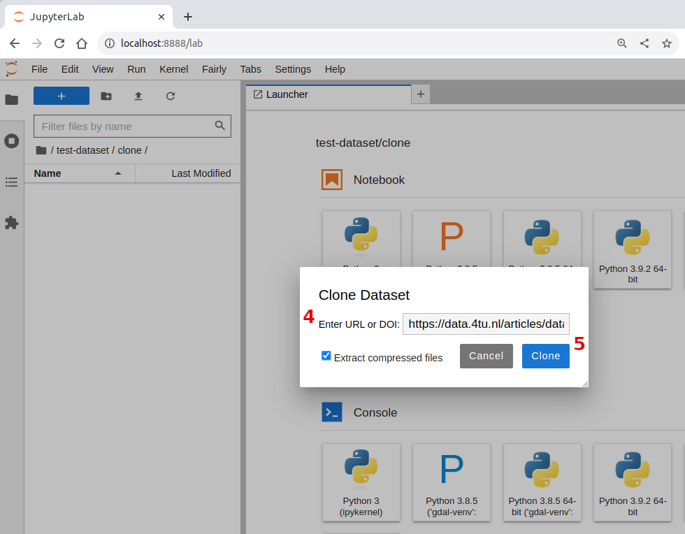

Using the JupyterLab Extension
==============================

This tutorial shows how to use the JupyterLab extension to clone and create research datasets using the graphical inteface of JupyterLab, and how to upload dataset  to popular research data repositories.

If you haven not done so, :ref:`install the full toolset. <installation>`

Start JupyterLab
------------------

Star JupyterLab with the **jupyter-fairly** extension. This will start JupterLab in your browser.

Windows
''''''''

You will use the Shell Terminal to start JupyterLab.

.. important::
   For the following to work, you need Pyton in the PATH environment variable on Windows. If you are not sure that is the case. Open the Shell, and type :code:`python --version`. You should see the version of Python on the screen. If you see otherwise, follow these steps to `add Python to the PATH on Windows <https://realpython.com/add-python-to-path/#how-to-add-python-to-path-on-windows>`_

On the shell type the following and press `Enter`:

.. code-block:: shell
   
   jupyter lab

Linux / MacOS
''''''''''''''''

From the terminal, run: 

.. code-block:: shell

   jupyter lab

JupyterLab should automatically start on you browser.

.. image:: ../img/start-jupyterlab.png

Part 1: Cloning Dastasets
----------------------------

Public research datasets can be cloned (copy and downloaded) directly to an empty directory, using the dataset's **URL** or **DOI**. We will use `this datset <https://data.4tu.nl/articles/dataset/Earthquake_Precursors_detected_by_convolutional_neural_network/21588096>`_ from 4TU.ResearchData as an example.

This are other datasets that you can try:

* https://zenodo.org/record/4302600
* https://zenodo.org/record/8273524
  
 
Using the JupyterLab interface, create a new directory called :code:`workshop`. *Notice that the content of your main directory would be different.*

1. Inside the workshop directory, create a new directory called :code:`clone`
2. Right click on the left panel to open the context menu
3. Click on :guilabel:`Clone Dataset`
4. Copy and paste the URL for the example dataset on the dialog window
5. Click :guilabel:`Clone`

.. image:: ../img/clone1.png

A notification on the bottom-right corner will let you know when the *cloning* is complete, and you should see a list of files on JupyterLab. All the files, except for :code:`manifest.yaml` are files that belong to the dataset in the research repository. The file :code:`manifest.yaml` is automatically created by the Fairly Toolset, and it contains metadata from the research data repository, such as:

- Authors 
- Keywords
- License
- DOI
- Files in the dataset
- etc.

Part 2: Create a Fairly Dataset
---------------------------------------------

Here, we show you how can you create and prepare your own dataset using the JupyterLab extension of *fairly*.

   1. Create a new directory called :code:`mydataset` inside the *workshop directory*.
   2. Inside :code:`workshop/mydataset/`. Open the context menu and click on :guilabel:`Create Fairly Dataset`
   3. Select :guilabel:`Zenodo` as template from the drop-down list. *Notice that there are templates for other data repositories*. 
   4. Click :guilabel:`Create`. A :code:`manifest.yaml` file will be add to the *dummy-data* directory. This file contains a list of fields that you can edit to add metadata to your dataset. 

Include Files in your Dataset
''''''''''''''''''''''''''''''''

Add some files to the :code:`mydataset` directory. You can add files of your own, but be careful not to include anything that you want to keep confidential. Also consider the size of the files you will add, the larger the size the longer the upload will take. Also remember that for the current Zenodo API each file should be :code:`100MB` or smaller; this will change in the future.

If you do not want to use your own files, you can download and use the `dummy-data <https://drive.google.com/drive/folders/160N6MCmiKV3g-74idCgyyul9UdoPRO8T?usp=share_link>`_ 

After you have added some file and/or folders to :code:`mydataset`, JupyterLab should look something like this:

.. image:: ../img/my-dataset.png

Editing the Manifest
''''''''''''''''''''''

The :code:`manifest.yaml` file contains several sections to describe the medatadata of a dataset. Some of the sections and fiels are compulsory (they are required by the researh data repository), others are optional. In this example you started a *fairly* dataset using the template for the Zenodo repository, but you could also do so for 4TU.ResearchData. 

However, if you are not sure which repository you will use to publish a dataset, use the :guilabel:`Default` template. This template contains the most common sections and fields for the repositories supported by the Fairly Toolset.

.. tip::
   Independently of which template you use to start a dataset, the :code:`manifest.yaml` file is interoperable between data repositories, with very few exceptions. This means that you can use the same manifest file for various data repositories. Different templates are provided only as a guide to indicate what metadata is more relevant for each data repository. 

1. Open the :code:`manifest.yaml` file using the context menu, or by doble-clicking on the file

2. Substitute the content of the :code:`manifest.yaml` with the text below.  *Here, we use only a small set of fields that are possible for Zenodo.*

.. code-block:: yaml
   
   metadata:
     type: dataset
     publication_date: '2023-08-31'
     title: My Title
     authors:
     - fullname: Surname, FirstName
       affiliation: Your institution
     description: A dataset from the Fairly Toolset workshop
     access_type: open
     license: CC0-1.0
     doi: ''
     prereserve_doi:
     keywords:
     - fairly-toolset
     - tutorial
     - dummy data
     notes: ''
     related_identifiers: []
     communities: []
     grants: []
     subjects: []
     version: 1.0.0
     language: eng
   template: zenodo
   files:
     includes:
     - ARP1_.info
     - ARP1_d01.zip
     - my_code.py
     - Survey_AI.csv
     - wind-mill.jpg
     excludes: []

3. Edit the dataset metadata by typing the information you want to add. For example, you can change the title, authors, description, etc. Save the file when you are done.

.. important:: 
   * The :code:`includes`  field must list the files  and directories (folders) you want to include as part of the dataset. *Included files and directories will be uploaded to the the data repository* 
   * The :code:`excludes` field can be used for explicitly indicating what files or directories you **don't want to be part  of the dataset**, for example, files that contain sensitive information. Excluded files and directories will never be uploaded to the data repository. 
   * Files and directories that are not listed in either :code:`includes` or :code:`excludes` will be ignored by *fairly*.

Part 3: Upload Dataset to Repository
-------------------------------------

In the last part of this tutorial, we explain how to upload a dataset to an existing account in Zenodo. If you do not have an account yet, you can `sign up in this webpage. <https://zenodo.org/signup/>`_

.. _create-token:
Create Personal Token
''''''''''''''''''''''

A personal token is a way in which data repositories identify a user. We need to register a personal token for creating datasets in the repository and uploading files to an specific account.

1. Sign in to Zenodo. 
2. On the top-right corner click on drop-down arrow, then :guilabel:`Applicaitons`.
3. On the section :guilabel:`Personal access tokens`, click the :guilabel:`New token` button.
4. Enter a name for your token, for example: :code:`workshop`
5. For scopes, check all three boxes, and click :guilabel:`Create`
6. Copy the token (list of characters in red) to somewhere secure. **You will only see the token once.**
7. Under :guilabel:`Scopes`, check all three boxes once more. Then click :guilabel:`Save`

.. image:: ../img/zenodo-token.png

.. _configuring-fairly:
Register Personal Token
''''''''''''''''''''''''''''''''

To register a personal token to the Fairly Toolset, do the following in JupyterLab:

1. Open the :guilabel:`Fairly` menu on the top menu bar, and click on :guilabel:`Add Repository Token`
2. Select :guilabel:`Zenodo` from the drop-down list.
3. Paste the token you copied from Zenodo in the previous step.
4. Click :guilabel:`Add Token`

.. important:: 
   * You can register tokens for other repositories supporte by *fairly* in the same way. Tokens added in this way are global, and will be used by by the JupyterLab extension, the Python package and the CLI.
   * Tokens are stored in a file called :code:`config.json` in your user home directory. This file is created automatically by *fairly* when you register a token. For Windows the file is located in :code:`C:\\Users\\<You-user-name>\\.fairly\\config.json`, and for Linux/MacOS in :code:`~/.fairly/config.json`. 
   * To **update a token**, simply register a new token with the same name. The old token will be replaced by the new one. To **remove a token**, simply repeate the process, but type a random character in the token field.

.. warning::
   If you are using the Fairly Toolset in a shared computer, make sure that you **remove your tokens** from the JupterLab extension. Otherwise, other users of the computer will be able to use your token to create datasets in your account.

.. note::
   Windows users might need to re-start JupyterLab for the tokens to work correctly when uploading datasets.

Upload Dataset
''''''''''''''''

1. On the left panel, do right-click, and then click :guilabel:`Upload Dataset`
2. Select Zenodo from the dowp-down list, and click :guilabel:`Continue`
3. Confirm that you want to upload the dataset to Zenodo by ticking the checkbox.
4. Click :guilabel:`OK`. A notification on the bottom-right corner will let you know that the upload is in progress and when it is complete.
5. Go to your Zenodo account and click on :guilabel:`Upload`. The `my dataset` dataset should be there. 

.. image:: ../img/zenodo-upload.png

Explore the dataset and notice that all the files and metadata you added in JupyterLab has been automatically added to the new dataset. You should also notice that the dataset is not **published**, this is on purpose. This gives you the oportunity to review the dataset before deciding to publish if, and if necessary to make changes. In this way we also prevent users to publish dataset by mistake.

.. note:: 
   If you try to upload the dataset again, you will get an error message. This is because the dataset already exists in Zenodo. You can see this reflected in the :code:`manifest.yaml` file;  the section :code:`remotes:` is added to the file after succesfully uploading a dataset. It lists the names and ids of the repositories where the dataset has been uploaded.
   In the future, we will add a feature to allow users to update and sync datasets between repositories.
